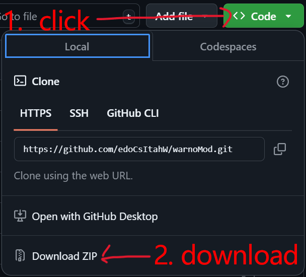
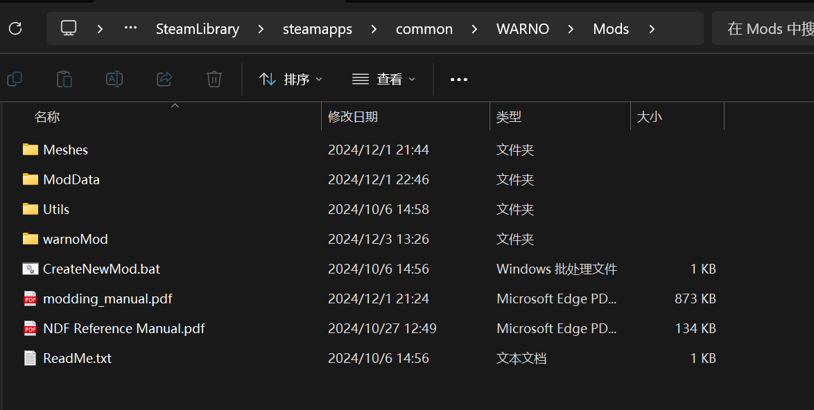

# WARNO Mod

**Englsh** | **[简体中文](./README_zh.md)**

The WARNO Mod is a modification for the game WARNO.

This mod was created to address the pain point of mod creators needing to frequently update their mods in the WARNO Workshop to maintain normal usage for users, especially after game updates.

It also helps players avoid the endless wait for mod creators to update their mods.

Although it does not directly change the game's update mechanism, it allows users to download mod source files locally. After a game update, users can easily update the mod themselves, reducing the frequent update requests to mod authors.

## Table of Contents

1. [Features](#features)
   * [As a Project](#as-a-project)
   * [In the Game](#in-the-game)
2. [Usage Instructions](#usage-instructions)
   * [Download and Generate](#download-and-generate)
   * [Update the Mod](#update-the-mod)
3. [Developing the Mod](#developing-the-mod)
   * [Game File Structure and Explanation](#game-file-structure-and-explanation)
   * [Toolset File Structure and Explanation](#toolset-file-structure-and-explanation)
   * [Other Reference Materials](#other-reference-materials)
4. [To-Do List](#to-do-list)

## Features

### As a Project

1. It includes a lexer and parser for the NDF language, capable of parsing NDF scripts into JSON format abstract syntax trees (hereinafter referred to as AST), providing the ability to programmatically modify NDF scripts.
   * [docs](./utils/ndf/cpp/docs/en/index.html)

2. It offers a Python interface for converting JSON format ASTs into AST class objects, making it easy to manipulate the AST.

### In the Game

1. When creating a combat group (division), it provides a combat group with all units (including both red and blue sides), and all nine slots in the combat group are activated.

2. In the battle interface, the maximum number of aircraft and slots has been expanded to 5x5.

## Usage Instructions

### Download and Generate

#### Regular Download

1. Open the project website: [GitHub Project Link](https://github.com/edoCsItahW/warnoMod)

2. Download the mod zip file: 
    

3. Extract the zip file to the *mods* folder under the game directory:
   

4. Click into the *warnoMod* folder
   1. Click *UpdateMod.bat* to update the mod (if you are sure there hasn’t been a recent update to WARNO, you can skip this step) -- issues in this step are explained [below](#update-the-mod).
   2. Click *GenerateMod.bat* to generate the mod.
   3. (Optional) If this mod (as a local mod) conflicts with mods downloaded from the Workshop, you can modify the `Name` field in *C:\Users\<username>\Saved Games\EugenSystems\WARNO\mod\Config.ini* to make it different from the name of the local mod.

#### Using Git

1. Navigate to the *mods* path under the game directory and use the `git clone` command to clone the project:

    ```dos
    git clone https://github.com/edoCsItahW/warnoMod.git
    ```

### Update the Mod

#### Normal Situation

Eugen has specific solutions, see [Modding Manual](./utils/usefulInfo/Modding Manual.pdf), and I will briefly summarize here.

Typically, you will see:
   ```dos
   Updating mod: warnoMod
   
   Mod updated with conflicts. Files needing manual correction:
   
       GameData\Gameplay\Unit\Tactic\xxxx1.ndf
       GameData\Generated\Gameplay\Decks\xxxx2.ndf
   
   Please merge your changes, and press <Enter> when you're done. You will then be based on the latest release of the game.
   ```

This means that files *xxxx1.ndf* and *xxxx2.ndf* have been updated by Eugen, and the updated scripts conflict with your local scripts, requiring manual merging. After manually merging, press the Enter key, and you will then
Certainly! Here’s the continuation of the translation:

---

be based on the latest version of the game.

You can open the conflicting files to find sections marked like:

<details>

   <summary>Due to being lengthy and collapsed, click to expand the example...</summary>

   ```ndf
   <<<<<<<
       ModulesDescriptors =
       [
           TAllianceDescriptionModuleDescriptor
           (
           ),
           TAllianceScoreModuleDescriptor
           (
           ),
           TAllianceIncomeBonusModuleDescriptor
           (
           ),
           TAllianceRelationsModuleDescriptor
           (
           ),
       ]
   |||||||
       ModulesDescriptors =
       [
           TAllianceDescriptionModuleDescriptor
           (
           ),
           TAllianceScoreModuleDescriptor
           (
           ),
           TAllianceRelationsModuleDescriptor
           (
           ),
       ]
   =======
       ModulesDescriptors = [
           TAllianceDescriptionModuleDescriptor(),
           TAllianceScoreModuleDescriptor(),
           TAllianceRelationsModuleDescriptor(),
       ]
   >>>>>>>
   ```
</details>


In this section:

* The content between `<<<<<<<` and `|||||||` is the code updated by Eugen.
* The content between `|||||||` and `=======` is the shared portion of the code between Eugen's updates and your local code.
* The content between `=======` and `>>>>>>>` is your local code.

Generally, the section updated by Eugen has not been modified by you prior to the update, so you only need to keep the content between `<<<<<<<` and `|||||||`. However, if Eugen's updates require modifications to your code, more complex manual merging may be necessary.

<mark>If you can and believe you have resolved the conflicts completely, please submit a PR so that other players can quickly use your updates. Also, it's best to test in-game before submitting to ensure everything works correctly.</mark>

#### Exception Errors

There are many possibilities for errors, such as an issue with the *UpdateMod.py* script (e.g., UnicodeDecodeError) or logical problems between the NDF files, which would require specific analysis.

If you cannot resolve the issue, you can:

1. Check if there are existing [issues](https://github.com/edoCsItahW/warnoMod/issues); if there are, please refer to the solutions or participate in the discussion.

2. Be patient and wait; the waiting time depends on the project's activity and the number of contributors.

3. Publish an issue describing the problem in detail. If any specific steps caused the issue, please include those as well.

## Developing the Mod

<mark>Welcome to contribute to this project!</mark>

> [!TIP]
> If using `vscode` as your IDE, you can install my plugin `NDF Language Support`(search ndf) found here: [https://github.com/edoCsItahW/ndf](https://github.com/edoCsItahW/ndf). This plugin provides syntax highlighting for the NDF language, but does not yet offer auto-completion, formatting, or code checking features.

Fork + PR.

The specific workflow is not yet determined and will be discussed in the `discussion` section.

When modifying code, please follow these guidelines:

* For multi-line code:  
   At the start of the modification, include a comment specifying the functionality and intent of the change, like so:
   ```ndf
   // ANCHOR - ---------------- MODIFY: Implemented functions and intentions --------------
   
      // Your code here...
   
   // ------------------------- END MODIFY -------------------------
   ```

* For single-line code:  
   At the end of the modification, append a note like (it’s best to keep the original code or value in the comment):
   ```ndf
   (YouCodeHere, 2),  // ANCHOR - MODIFY: foo, bar (original value is 1)
   ```

This way, when conflicts arise due to Eugen's updates, it will be much easier to identify which lines were manually modified. Furthermore, it helps other developers understand the intent behind the modifications.

### Game File Structure and Explanation

See [Game File Structure and Explanation]()

### Toolset File Structure and Explanation

See [Toolset File Structure and Explanation](./utils/utilsFileStruc.md)

### Other Reference Materials

* [NDF Language Manual](./utils/usefulInfo/NDF Reference Manual.pdf)

* [Modding Manual](./utils/usefulInfo/Modding Manual.pdf)

## To-Do List

* [ ] (1). Implement parsing of specific comments in NDF scripts as slots to facilitate code insertion into designated locations within NDF scripts through AST. -- https://github.com/edoCsItahW/warnoMod/discussions/3
* [ ] (2). Provide a Python interface for a C++ implemented NDF language parser using `Pybind11` for easier NDF script parsing and modification. -- https://github.com/edoCsItahW/warnoMod/discussions/4
* [ ] (3). Based on (1), implement a mod function toggle and provide a user interface to allow players to enable or disable mod functions. -- https://github.com/edoCsItahW/warnoMod/discussions/5

Finally, Enjoy the game!
