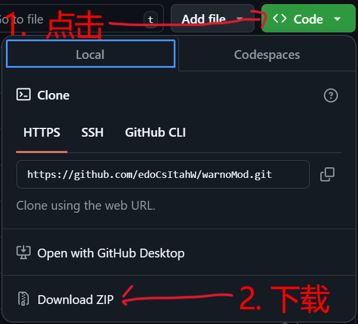

# WARNO 模组

**[Englsh](./README.md)** | **简体中文**

WARNO Mod是游戏WARNO的模组.

该模组是为了解决WARNO的创意工坊中的模组需要制作者频繁跟随游戏更新而更新以维持用户的正常使用的痛点而制作的.

同时也避免了玩家陷入无尽地等待模组制作者更新的痛苦之中.

它虽然没有直接更改游戏的更新机制,但是通过直接将模组源文件下载到本地的方式,可以让用户在游戏更新后通过简单的方式自己更新模组,从而避免了对模组作者的频繁更新要求.

## 目录

1. [功能](#功能)
   * [作为项目](#作为项目)
   * [在游戏中](#在游戏中)
2. [使用方法](#使用方法)
   * [下载与生成](#下载与生成)
   * [更新模组](#更新模组)
3. [开发该模组](#开发该模组)
   * [游戏文件结构与说明](#游戏文件结构与说明)
   * [工具集文件结构与说明](#工具集文件结构与说明)
   * [其它参考资料](#其它参考资料)
4. [待办列表](#待办列表)

## 功能

### 作为项目

1. 具有NDF语言词法与语法分析器,可以解析NDF脚本为JSON格式抽象语法树(以下简称AST),以提供程序化NDF脚本修改能力.

2. 对于将JSON格式抽象语法树转换为抽象语法树类的功能提供了Python接口,可以方便地进行AST的操作.

### 在游戏中

1. 在创建战斗群(师)中提供了一个具有所有单位的战斗群(包括红蓝双方),且该战斗群的9个槽位全部激活.

2. 在战斗界面中对最大飞机数和槽位进行了扩充,达到5x5.

## 使用方法

### 下载与生成

#### 普通下载

1. 打开项目网址: [github项目地址](https://github.com/edoCsItahW/warnoMod) | [gitee项目地址](https://gitee.com/xiao040216qq/warnoMod)

2. 下载模组压缩包: 
   - github: 
      
   - gitee: 
      1. 点击`克隆/下载`
      2. 点击`下载ZIP`

3. 解压压缩包到游戏目录下的*mods*文件夹下:
   

4. 点击进入*warnoMod*文件夹
   1. 点击*UpdateMod.bat*更新模组(如果你确定近期Warno没有更新,可以不更新) -- 该步骤中的问题在下文有[说明](#更新模组).
   2. 点击*GenerateMod.bat*生成模组
   3. (可选)如果该mod(作为本地模组)与从创意工坊下载的mod冲突,可以修改*C:\Users\<username>\Saved Games\EugenSystems\WARNO\mod\Config.ini*中的`Name`字段,使其与本地模组的名称不同.

#### 使用git

1. 进入到游戏目录下的*mods*路径下,使用`git clone`命令克隆项目:

   - github:
      ```dos
      git clone https://github.com/edoCsItahW/warnoMod.git
      ```

   - gitee:
      ```dos
      git clone https://gitee.com/xiao040216qq/warnoMod.git
      ```

### 更新模组

#### 正常情况

欧根有具体解决方法,见[改装手册中文版](./utils/usefulInfo/Modding Manual_CN.pdf),在此我简述一下.

一般显示如:
   ```dos
   Updating mod: warnoMod
   
   Mod updated with conflicts. Files needing manual correction:
   
       GameData\Gameplay\Unit\Tactic\xxxx1.ndf
       GameData\Generated\Gameplay\Decks\xxxx2.ndf
   
   Please merge your changes, and press <Enter> when you're done. You will then be    based on the latest release of the game.
   ```

意思是有文件*xxxx1.ndf*和*xxxx2.ndf*被欧根更新了,它更新的脚本与你本地的脚本有冲突,需要手动合并,请手动合并后按回车键,然后你将基于最新版本的游戏进行操作.

你可以打开有冲突的文件,找到该文件中形如:

<details>

   <summary>由于冗长而被收起,点击展开示例...</summary>
   
   ```ndf
   <<<<<<<
       ModulesDescriptors =
       [
           TAllianceDescriptionModuleDescriptor
           (
           ),
           TAllianceScoreModuleDescriptor
           (
           ),
           TAllianceIncomeBonusModuleDescriptor
           (
           ),
           TAllianceRelationsModuleDescriptor
           (
           ),
   |||||||
       ModulesDescriptors =
       [
           TAllianceDescriptionModuleDescriptor
           (
           ),
           TAllianceScoreModuleDescriptor
           (
           ),
           TAllianceRelationsModuleDescriptor
           (
           ),
   =======
       ModulesDescriptors = [
           TAllianceDescriptionModuleDescriptor(),
           TAllianceScoreModuleDescriptor(),
           TAllianceRelationsModuleDescriptor(),
   >>>>>>>
   ```
</details>

的位置,这里

* `<<<<<<<`到`|||||||`中间的内容是欧根更新的代码
* `|||||||`到`=======`中间的内容是欧根的代码和你本地的代码共有的部分
* `=======`到`>>>>>>>`中间的内容是你本地的代码

一般情况下欧根更新的部分在没更新之前你是没有修改的,这样只保留`<<<<<<<`和`|||||||`之间的更新内容即可,但如果欧根确实需要修改你写的代码,那可能确实需要进行复杂的手动合并了.

<mark>如果可以并且你认为已经完全解决了冲突,请提交一个PR,让其它玩家可以尽快使用你的更新.当然,最后能在提交前进入游戏进行游玩测试,以确保没有问题.</mark>

#### 异常错误

这个情况很多,可能是*UpdateMod.py*脚本异常(例如UnicodeDecodeError),也可能是NDF文件之间的逻辑问题,需要具体分析.

如果你无法解决,你可以:

1. 查看是否已有[issue](https://github.com/edoCsItahW/warnoMod/issues),如果有,请参考解决方法或参与讨论.

2. 耐心等待,等待时间视该项目热度和贡献者数量而定.

3. 发布issue,详细描述该问题,如果造成该问题时你有额外步骤请一并附上.

## 开发该模组

<mark>欢迎做出贡献!</mark>

> [!TIP]
> 如果使用`vscode`作为IDE,可以安装我的插件`NDF Language Support`(搜ndf)插件,其项目地址: [https://github.com/edoCsItahW/ndf](https://github.com/edoCsItahW/ndf),该插件可以提供NDF语言的语法高亮,但还不具有自动补全,格式化和代码检查等功能.

Fork + PR.

具体工作流暂未确定,将在`disscussion`中讨论.

请在修改代码时,对于:

* 多行代码:  
   在修改代码的开头写一个注释包含修改的功能和意图,形如:
   ```ndf
   // ANCHOR - ---------------- MODIFY: Implemented functions and intentions(实现功能和意图) --------------
   
      // You code here...
   
   // ------------------------- END MODIFY -------------------------
   ```

* 单行代码:  
   在修改代码的结尾加上形如(最好在注释中保留原始代码或数值):
   ```ndf
   (YouCodeHere, 2),  // ANCHOR - MODIFY: foo, bar(original value is 1)
   ```
   

这样最大的好处是当由于欧根更新而产生冲突时,可以很容易地知道哪些代码是人为修改的,同时也方便其它开发者了解修改意图.

> [!NOTE]
> 如果你从<u>gitee</u>克隆项目,则默认远程仓库为<u>gitee</u>仓库,请务必将远程仓库改为<u>github</u>仓库或推往<u>github</u>仓库:
> * 修改为github仓库:
>    ```dos
>    git remote set-url origin https://github.com/edoCsItahW/warnoMod.git
>    git push origin main
>    ```
> * 推送到github仓库:
>    ```dos
>    git remote add github https://github.com/edoCsItahW/warnoMod.git
>    git push github main
>    ```

### 游戏文件结构与说明

参见[游戏文件结构与说明]()

### 工具集文件结构与说明

参见[工具集文件结构与说明](./utils/utilsFileStruc_zh.md)

### 其它参考资料

* [NDF语言手册中文版](./utils/usefulInfo/NDF Reference Manual_CN.pdf)

* [改装手册中文版](./utils/usefulInfo/Modding Manual_CN.pdf)

## 待办列表

* [ ] (1). 通过解析NDF脚本中的特定注释作为插槽,以方便通过AST向NDF脚本中的指定位置插入代码. -- https://github.com/edoCsItahW/warnoMod/discussions/3
* [ ] (2). 通过`Pybind11`提供基于C++实现的NDF语言解析器的Python接口,以方便进行NDF脚本的解析与修改. -- https://github.com/edoCsItahW/warnoMod/discussions/4
* [ ] (3). 基于(1),实现一个模组功能开关,并提供用户界面,以方便玩家进行模组功能的启用与禁用. -- https://github.com/edoCsItahW/warnoMod/discussions/5


最后,享受游戏吧!
