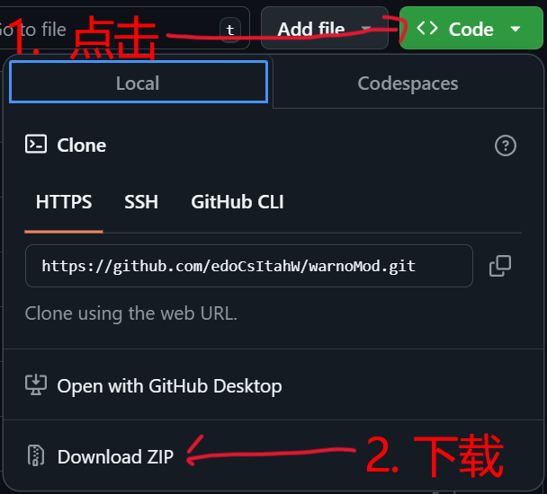

# WARNO 模组

WARNO Mod是游戏WARNO的模组.

该Mod是为了解决WARNO的创意工坊中的Mod需要制作者频繁跟随游戏更新而更新以维持用户的正常使用的痛点而制作的.

它虽然没有直接更改游戏的更新机制,但是通过直接将Mod源文件下载到本地的方式,可以让用户在游戏更新后通过简单的方式手动更新Mod,从而避免了对Mod作者的频繁更新要求.

## 目录

1. [功能](#功能)
2. [使用方法](#使用方法)

## 功能

### 作为项目

### 在游戏中

## 使用方法

### 下载与生成

#### 普通下载

1. 打开项目网址: [github项目地址](https://github.com/edoCsItahW/warnoMod)

2. 下载模组压缩包: 
   

3. 解压压缩包到

#### 使用git

1. 进入到游戏目录
